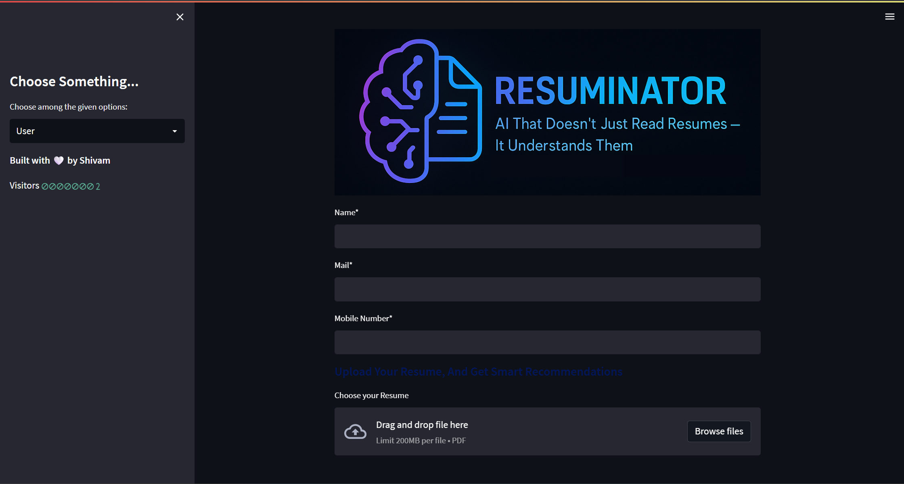
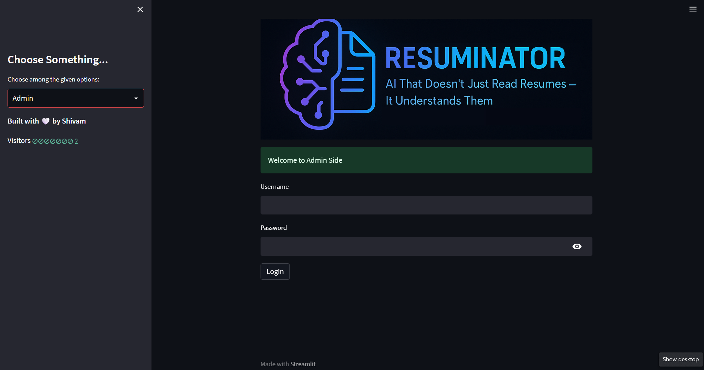
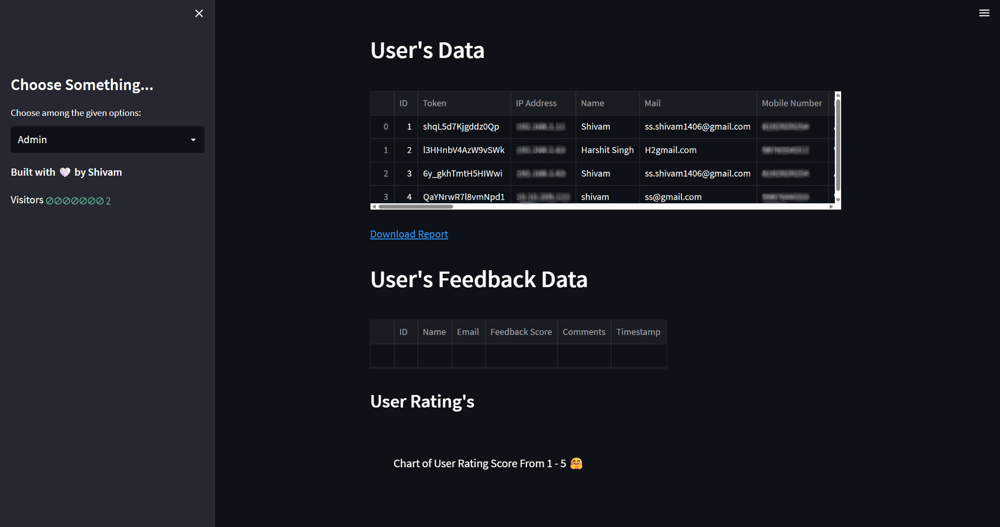
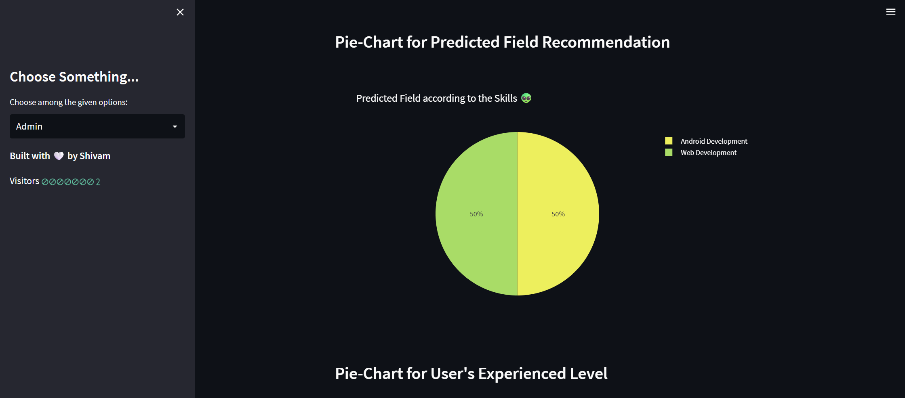
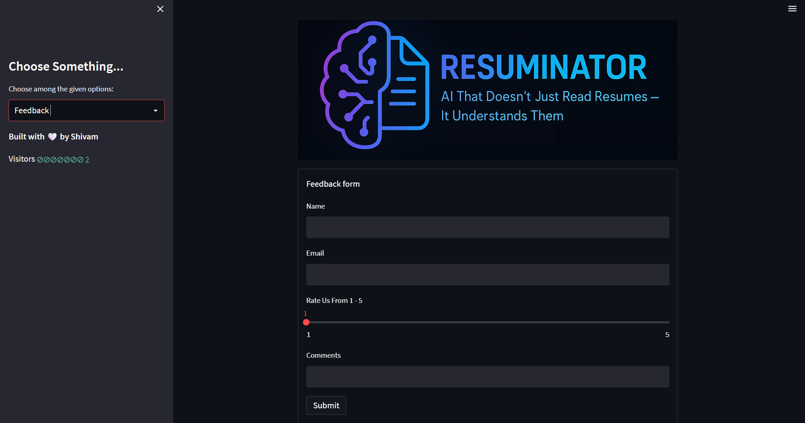
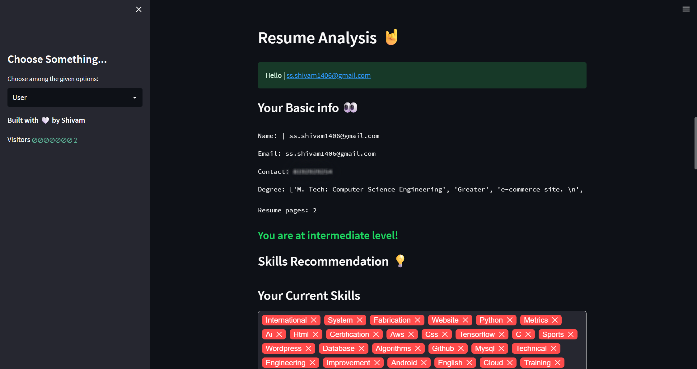
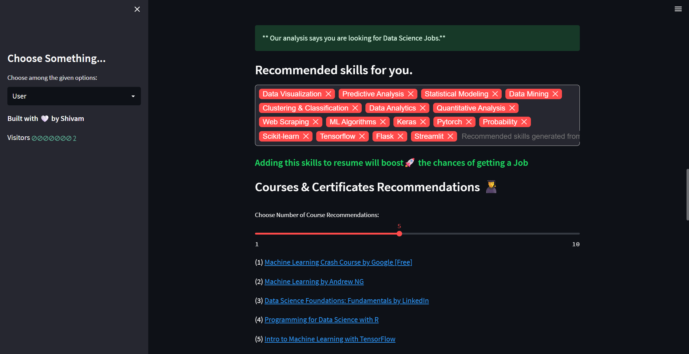
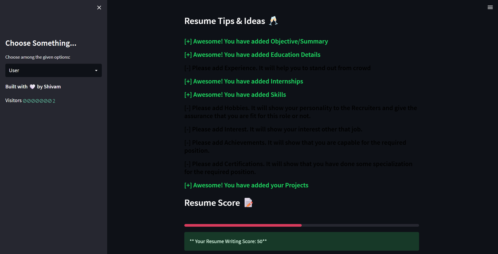

# Resuminator
## AI That Doesn’t Just Read Resumes — It Understands Them
### Analyze · Predict · Recommend — Smart Insights for Smarter Careers


[](LICENSE)
[](https://github.com/shivam1406/Resuminator/commits/master)


Developed with 🤍 by [Shivam](href="https://www.linkedin.com/in/ssshivam1406/")

---

## 🔍 About the Project

**Resuminator** leverages advanced **Natural Language Processing (NLP)** to extract, analyze, and score resume content. It provides actionable feedback, sector-specific keyword analysis, job role predictions, and recommendations — helping both applicants and recruiters make data-driven decisions.



---

## 📌 Key Features

### 👤 User Module
- Resume parsing: basic details, skills, keywords
- AI-based recommendations:
  - Skills to add
  - Predicted job role
  - Relevant courses/certifications
  - Resume improvement tips
- Resume scoring system
- Interview & resume prep videos

### 🛠 Admin Dashboard
- View all uploaded resumes and parsed data
- Export data as CSV
- Visual insights via interactive pie charts:
  - Resume scores
  - Job roles
  - Experience levels
  - Ratings
  - Geographic data (City, State, Country)
- Manage user feedback and ratings

### 📝 Feedback System
- User ratings (1–5)
- Comment history
- Ratings analytics

---

## 🎯 Scope of the Tool

1. Extract resumes into structured CSV/tabular data
2. Generate personalized suggestions and scores for users
3. Useful insights for colleges during placements
4. Monitor market trends via role prediction data
5. Enable continuous product improvement via feedback

---

## 🧠 Tech Stack

- **Frontend:** Streamlit, HTML, CSS, JavaScript
- **Backend:** Python, Streamlit
- **Database:** MySQL
- **Python Modules:** pandas, pyresparser, pdfminer3, NLTK, Plotly
---

## ⚙️ Requirements

Ensure the following are installed:

- [Python 3.9.12](https://www.python.org/downloads/release/python-3912/)
- [MySQL Server](https://www.mysql.com/downloads/)
- [Visual Studio Code](https://code.visualstudio.com/Download)
- [Visual Studio Build Tools for C++](https://aka.ms/vs/17/release/vs_BuildTools.exe)

---

## 🚀 Setup & Installation

```bash
# Clone the repository
git clone https://github.com/shivam1406/Resuminator.git
cd Resuminator

# Create and activate virtual environment
python -m venv venvapp
venvapp\Scripts\activate  # For Windows

# Going back to the root folder
cd..\.. 

# Navigate to App folder and install dependencies
cd App
pip install -r requirements.txt
python -m spacy download en_core_web_sm
```

## Database Setup
1. Create a MySQL database named cv
2. Update database credentials in App.py (Line 95):
```bash
connection = pymysql.connect(host='localhost', user='root', password='admin@123', db='cv')
```
3. Replace the resume_parser.py file inside:
```bash
venvapp\Lib\site-packages\pyresparser\
```
4. Create a folder "Uploaded_Resumes" in App

With the modified version from the provided pyresparser folder.

## 🧪 Running the Application
```bash
streamlit run App.py
```
Use the test resume in the Uploaded_Resumes folder to begin.

## Admin Credentials:
```bash
Username: admin
Password: admin@123
```

## 📸 Screenshots

### ✨ Dashboard


### ✨ Admin Login


### ✨ Admin Dashboard


### ✨ Pie Charts on Admin Dashboard


### ✨ Feedback


### ✨ Resume Analysis




## 📌 Notes
🔗 Best viewed in Light Mode and on Desktop for full functionality.

## 🤝 Contribute
Pull requests welcome! For major changes, open an issue first to discuss what you’d like to change.

## 📄 License
This project is licensed under the [MIT License](LICENSE).

## 🙋‍♂️ Author

**Shivam**  
📧 [ss.shivam1406@gmail.com](mailto:ss.shivam1406@gmail.com)  
🔗 [LinkedIn – ssshivam1406](https://www.linkedin.com/in/ssshivam1406/)
